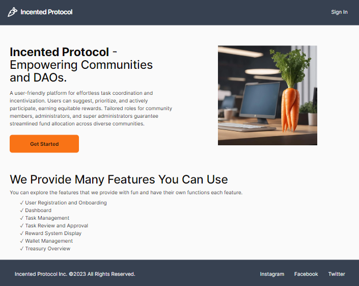

# 👋 Hi there, I'm Nazim

I'm a software developer with a background in front-end & back-end development.  Currently seeking to collaborate on new projects and engaged in learning new technologies. 

## 🧰 Skills

- ***Languages:***  

  
  
  

- ***Framework/Libraries:***  

  
  
  
  

- ***Databases:***  

  
  
- ***Tools:***  

  
  
  
  
  

## ⚙️ Projects

<table>

<tr>
	<td align="center"  width="50%">
	<h3>Incented Protocol</h3>
	
	 
	 
 	

	  
	
	

	

	A user-friendly platform for effortless task coordination and incentivization. Users can suggest, prioritize, and actively participate, earning equitable rewards.
	

	

	<strong><i>Next.js, Tailwind CSS, Shadcn UI, Supabase</i></strong>
	

	

	<i>Official repo handed over to client.  Repo link provided here is for a copied repo used for testing. </i>
	

	</td>
 	 
	<td>
	Project 2
	</td>
</tr>

<tr>

<td>
	Project 3
</td>
<td>
				<h3 align="center">Incented Protocol</h3>
				
  
					
					 
					 
					

						  
						
					

					
<strong>HTML, CSS, Javascript, React, Python (Flask), Geotab Datasets</strong>

          

            Hfdfdinner   A tool for car insurance companies to leverage Geotab telematics and location data to make better data-driven insurance premium pricing decisions.
					

				

			</td>
  
</tr>

  
</table>

  

<!--
**nbacc12/nbacc12** is a ✨ _special_ ✨ repository because its `README.md` (this file) appears on your GitHub profile.

Here are some ideas to get you started:

- 🔭 I’m currently working on ...
- 🌱 I’m currently learning ...
- 👯 I’m looking to collaborate on ...
- 🤔 I’m looking for help with ...
- 💬 Ask me about ...
- 📫 How to reach me: ...
- 😄 Pronouns: ...
- ⚡ Fun fact: ...
-->
